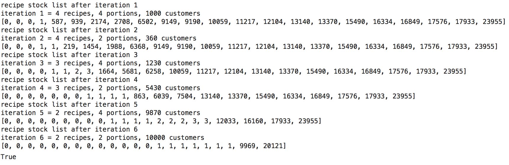

# Recipe-Allocator
Recipe Allocator Algorithm

This algorithm basically sorts the stocks in ascending order, and the orders in descending order of (num_recipes, num_portions). For each (num_recipe, num_portion) category, we start greedily allocating/removing stocks from the sorted stocks_list. As we keep reaching the limit of number of stocks available for the least available recipe, we keep removing them and continuing to iterate. If we exhaust the stocks_list before iterating through all the (num_recipe, num_portion) combinations, we return False meaning that there aren’t enough recipes for defaulters, under the constraint that we can’t repeat recipes for any of them. Time-complexity wise, this if we denote number_of_recipes_for_defaults as n, and number_of_portions_for_defaults as p and the length_of_stocks_list as s, this algorithm is O(np + s).

This repo includes 

- the core algorithm code.
- flask app with 2 endpoints:
  - /static/ : for static GET requests, where the app picks up data from a fixed path.
  - /dynamic/ : for dynamic POST requests, wehre the app picks up data from the body of post request message.
- jupyter notebooks that demo the allgorithm and display various test cases and how the algorithm performs on those.
- Dockerfile with build and start shell scripts to facilitate instantiating this as a standalone app, hosted on 0.0.0.0:5000
- requirements.txt for dependencies and some sample data as json files to facilitate the static app endpoint.
